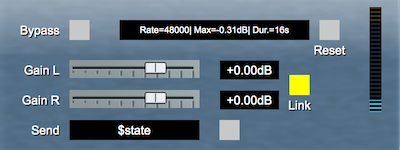

Jamba Sample - Simple Gain plugin
=================================
The goal of this project is to serve as documentation for the [Jamba](https://github.com/pongasoft/jamba) framework. It shows some of the most important features of the framework. The code is heavily documented to explain the various concepts and features. The end result for this project is a plugin similar to the `again` example plugin provided with the VST SDK.

If you just want to build the project then skip to [Configuration](#configuration).

If you want to create your own plugin, check [Quick Starting Guide](https://jamba.dev/quickstart/).

This is what the plugin looks like:

Concepts
--------
Jamba is a set of helpers (classes, concepts, build files, etc...) built on top of the VST SDK to provide a lightweight framework to build a VST2/3 plugin.

### Parameters
VST parameters are what the host DAW deal with (for example a knob is usually tied to a VST parameter). Both the GUI and the RT (Real Time) are "sharing" those parameters. As a result Jamba makes them front and center: you define them in one place and use them in the GUI and RT. Check the file [JSGainPlugin.h](src/cpp/JSGainPlugin.h)

Note: the Jamba framework introduces a new kind of parameters that go beyond VST parameters (which are limited to a double value in the range \[0.0, 1.0]).

    | ID   | TITLE      | TYP | OW | TRS | SHA | DEF.N | DEF.S          | STP | FLG   | SHORT  | PRE | UID | UNS |
    --------------------------------------------------------------------------------------------------------------
    | 1000 | Bypass     | vst | rt |     |     | 0.000 | Off            | 1   | 65537 | Bypass | 4   | 0   |     |
    --------------------------------------------------------------------------------------------------------------
    | 2010 | Left Gain  | vst | rt |     |     | 0.700 | +0.00dB        | 0   | 1     | GainL  | 2   | 0   |     |
    --------------------------------------------------------------------------------------------------------------
    | 2011 | Right Gain | vst | rt |     |     | 0.700 | +0.00dB        | 0   | 1     | GainR  | 2   | 0   |     |
    --------------------------------------------------------------------------------------------------------------
    | 2012 | Link       | vst | ui |     |     | 1.000 | On             | 1   | 1     | Link   | 4   | 0   |     |
    --------------------------------------------------------------------------------------------------------------
    | 2020 | Reset Max  | vst | rt |     |     | 0.000 | Off            | 1   | 1     | Reset  | 4   | 0   |     |
    --------------------------------------------------------------------------------------------------------------
    | 2000 | VuPPM      | vst | rt | x   |     | 0.000 | 0.0000         | 0   | 1     | VuPPM  | 4   | 0   |     |
    --------------------------------------------------------------------------------------------------------------
    | 3000 | Stats      | jmb | rt | x   | x   |       | -oo            |     |       |        |     |     |     |
    --------------------------------------------------------------------------------------------------------------
    | 2030 | Input Text | jmb | ui |     |     |       | Hello from GUI |     |       |        |     |     |     |
    --------------------------------------------------------------------------------------------------------------
    | 3010 | UIMessage  | jmb | ui | x   | x   |       |                |     |       |        |     |     |     |
    --------------------------------------------------------------------------------------------------------------

This table (generated by the plugin) shows the parameters used by the plugin.

### State
Jamba helps you deal with the state. From the parameters that you declare, you then define a `RTState` subclass (for the Real Time / processing code) and a `GUIState` subclass (for the GUI). Jamba then deals with the details of reading/writing the state in a thread safe fashion. Check the file [JSGainPlugin.h](src/cpp/JSGainPlugin.h)

This is what the `JSGainRTState` will read/save:

    Version=1
    | ID   | TITLE      |
    ---------------------
    | 1000 | Bypass     |
    ---------------------
    | 2010 | Left Gain  |
    ---------------------
    | 2011 | Right Gain |
    ---------------------
    | 2020 | Reset Max  |
    ---------------------

This is what the `JSGainGUIState` will read/save:

    Version=1
    | ID   | TITLE      |
    ---------------------
    | 2012 | Link       |
    ---------------------
    | 2030 | Input Text |
    ---------------------

### RT Processor
The Real Time (RT) processing code is where the main logic of the plugin resides. The DAW repeatedly calls the `process` method (actually `processInputs32Bits` or `processInputs64Bits` in Jamba) to process a batch of samples. This is usually called a "frame". The processor uses the `RTState` class. You simply need to inherit from `RTProcessor`. Check the file [JSGainProcessor.h](src/cpp/RT/JSGainProcessor.h)

### GUI Controller
The entry point of the GUI is the GUI controller. Jamba takes care of most of the details of the implementation for you: you simply need to inherit from `GUIController`. The controller uses the `GUIState` class (and makes it available to all the views). Check the file [JSGainController.h](src/cpp/GUI/JSGainController.h).

### Views
Each item in the UI is represented by a view (ex: a label, a knob, a slider, etc...). Jamba makes it very easy to create custom views which can implement complex behavior since they get access to the state. Check the 3 views provided as examples: [JSGainStatsView.h](src/cpp/GUI/JSGainStatsView.h), [JSGainSendMessageView.h](src/cpp/GUI/JSGainSendMessageView.h) and [LinkedSliderView.h](src/cpp/GUI/LinkedSliderView.h).

### Testing
Jamba also helps in providing an out of the box solution for (unit) testing using google test. Check [test-JSGain.cpp](test/cpp/test-JSGain.cpp) (and [CMakeLists.txt](CMakeLists.txt)).

### UI Editor
Once the plugin is running, you can right click on the background and select "Open UIDescription Editor" in order to enter the UI editor (only available in Debug build) that comes built-in with the VST3 SDK.

Configuration
-------------
The VST SDK will be automatically downloaded during the configure phase. This project requires C++17 and CMake 3.12+. See [Jamba Requirements](https://jamba.dev/requirements/) for more details.

Build this project
------------------

The following steps describes how to build the plugin: 

1. Invoke the `configure.py` python script to configure the project
2. Run the `jamba.sh` (resp. `jamba.bat`) command line to build, test validate...

### macOS:

- For simplicity I am creating the build at the root of the source tree, but can obviously be *outside* the source tree entirely by running the script from anywhere

        > ./configure.py -h
        usage: configure.py [-h] [-n] [-f] [-r] [--vst3 VST3_SDK_ROOT] [--vst2 VST2_SDK_ROOT] 
                            [-G GENERATOR] [-B BUILD_DIR] [-- <cmake_options>]
        
        positional arguments:
          cmake_options         Any options for cmake
        
        optional arguments:
          -h, --help            show this help message and exit
          -n, --dry-run         Dry run (prints what it is going to do)
          -f, --force           Force a regeneration (delete and recreate build folder)
          --vst3 VST3_SDK_ROOT  Path to the VST3 SDK (optional)
          --vst2 VST2_SDK_ROOT  Path to the VST2 SDK (optional)
          -r, --release         Use CMake Release build type (for single-config generators)
          -G GENERATOR, --generator GENERATOR
                                CMake generator (optional)
          -B BUILD_DIR, --build-dir BUILD_DIR
                                Build folder (defaults to ./build)
        
        Notes
          ---vst3 defaults to /Users/Shared/Steinberg/VST_SDK.<JAMBA_VST3SDK_VERSION>
          ---vst2 defaults to /Users/Shared/Steinberg/VST_SDK.<JAMBA_VST2SDK_VERSION>
        
          -G defaults to "Xcode" on macOS and "Visual Studio 16 2019" for Windows10
          run 'cmake --help' to get the list of generators supported
        
          For single-config generators, Debug is used by default and can be changed with -r for Release
          For multi-config generators, -r is ignored
        
          To provide extra options to CMake you do it this way
          python3 configure.py -- -Wdev
        
        Examples
          # Specify an explicit path to the VST3 sdk and uses default generator
          python3 configure.py ---vst3 /opt/local/VST_SDK.3.7.0
        
          # Use default paths and uses another generator
          python3 configure.py -G "CodeBlocks - Unix Makefiles"
        
          # Use defaults
        
        > ./configure.py
        > cd build

- In order to build, test, validate, etc... simply use the `jamba.sh` script like this:

        > ./jamba.sh -h
        usage: jamba.sh [-hnvbdr] <command> [<command> ...] [-- [native-options]]
        
        positional arguments:
          command        See "Commands" section
        
        optional arguments:
          -h, --help     show this help message and exit
          -n, --dry-run  Dry run (prints what it is going to do)
          -v, --verbose  Verbose build
          -b, --banner   Display a banner before every command
          -d, --debug    use Debug build config
          -r, --release  use Release build config
        
        Commands
          ---- Main commands ----
          clean     : clean all builds
          build     : build the plugin
          test      : run the tests for the plugin
          validate  : run the validator for the vst3 plugin
          edit      : run the editor (full editing available in Debug config only)
          install   : build and install all the plugins (vst2/vst3/audio unit)
          uninstall : delete the installed plugins (vst2/vst3/audio unit)
          archive   : create an archive containing the plugins
        
          ---- VST3 commands ----
          install-vst3   : install the vst3 plugin only
          uninstall-vst3 : uninstall the vst3 plugin only
        
          ---- VST2 commands ----
          install-vst2   : install the vst2 plugin only
          uninstall-vst2 : uninstall the vst2 plugin only
        
          ---- Audio Unit commands ----
          build-au     : builds the Audio Unit wrapper
          install-au   : install the vst2 plugin only
          uninstall-au : uninstall the vst2 plugin only
        
          ---- CMake target ----
          <command>   : Any unknown <command> is treated as a cmake target
        
          --- Native options ----
          Pass remaining options to the native tool (ex: -- -j 8 for parallel build)

Note: You can load the project directly in CLion (since CLion does not support the Xcode cmake generator, you can still work on the plugin but in order to build and install the Audio Unit wrapper you will need to use the command line).

### Windows

For windows, follow the same steps for macOS with the following changes:

* In order to invoke `configure.py` you need to use `python configure.py`
* The script is called `jamba.bat` (instead of `jamba.sh`)

Release Notes
-------------

### 2022-05-30 - `v1.2.8`
* use latest version of Jamba (v6.0.0)

### 2021-01-02 - `v1.2.7`
* use latest version of Jamba (v5.1.2)
* added support for Apple Silicon

### 2020-08-26 - `v1.2.6`
* use latest version of Jamba (v5.0.0)
* use `configure.py` instead of shell scripts

### 2020-04-26 - `v1.2.5`
* use latest version of Jamba (v4.4.0)
* changed sliders to respond only when the handle is dragged
* use simplified factory creation (in `JSGainVST3.cpp`)

### 2020-03-31 - `v1.2.4`
* use latest version of Jamba (v4.3.0)

### 2020-02-10 - `v1.2.3`
* use latest version of Jamba (v4.1.0)

### 2019-10-26 - `v1.2.2`
* use latest version of Jamba (v4.0.0) / C++17
* automatically downloads the VST SDK during config
* use new concepts (like `TextButtonView`)
* different name/uuid for debug plugin

### 2019-05-20 - `v1.2.1`
* updated README
* use latest version of Jamba (v3.2.1)

### 2019-01-03 - `v1.2.0`
* use latest version of Jamba (v3.0.0)

### 2018-10-06 - `v1.1.0`
* use latest version of Jamba (v2.1.0)
* Generate Audio Unit (wrapper) plugin
* Upgraded to cmake 3.12
* Consolidated dev scripts into a single `jamba.sh` (resp `jamba.bat`) script
* Uses `Xcode` as the cmake generator on macOS

### 2018-08-28 - `v1.0.1`
* changed build-prod.bat to use scripts

### 2018-08-25 - `v1.0.0`
* first public release / free / open source

Misc
----

This project uses [loguru](https://github.com/emilk/loguru) for logging.

Licensing
---------
GPL version 3
